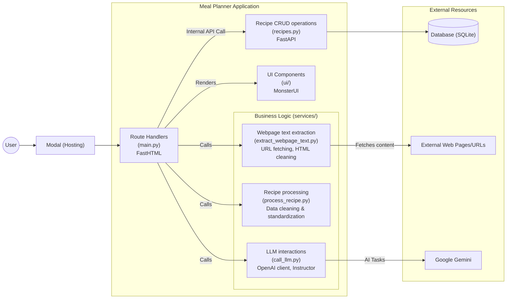

[](https://github.com/gsganden/meal_planner/actions/workflows/ci_cd.yml)
[](https://github.com/astral-sh/ruff)
[](https://opensource.org/licenses/Apache-2.0)
[](https://github.com/microsoft/pyright)
[](https://github.com/pre-commit/pre-commit)

# Meal Planner

AI-powered meal planning app. Under development. Running at https://gsganden--meal-planner-web.modal.run/.




## Setup

```bash
uv sync
```

[Get a Gemini API key](https://aistudio.google.com/apikey) and assign its value to a `GOOGLE_API_KEY` environment variable inside a dotenv file.

Install pre-commit hooks:

```bash
pre-commit install --hook-type pre-push -f
```

## Run App Locally

```bash
uv run modal serve meal_planner/main.py
```
## Run Tests

To run all the tests:

```bash
uv run pytest --runslow
```

To skip tests that make slow LLM calls:

```bash
uv run pytest
```

To check test coverage with minimal LLM calls:

```bash
./run_fast_coverage.sh
```
